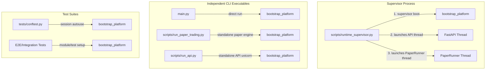

# TOJI Boot Call Graph

This document maps all entry points where the TOJI Platform Kernel (`bootstrap_platform()`) is initialized across the codebase.

---

## Detailed Call Graph Inventory

| Caller Location | When Invoked | Why Invoked |
| :--- | :--- | :--- |
| **`scripts/runtime_supervisor.py`** | Upon executing the main supervisor script. | To initialize the platform kernel exactly once at the parent process level, setting up the dependency injection container and event bus. |
| **`scripts/run_api.py`** | When running the FastAPI server standalone from the CLI. | To bootstrap the kernel instance dynamically if running standalone. |
| **`scripts/run_paper_trading.py`** | When running the Paper Trading Engine standalone from the CLI. | To bootstrap the kernel instance dynamically if running standalone. |
| **`main.py`** | When executing the unified production launcher directly. | To initialize the platform kernel prior to starting the long-running idle loop. |
| **`tests/conftest.py`** | Automatically triggered once per pytest session. | To instantiate a clean database and mock environment configuration for all unit/E2E tests. |
| **`tests/e2e/test_end_to_end_trading_verification.py`** | Module-scoped fixture initialization. | To initialize a localized test platform environment. |
| **`tests/e2e/test_signal_lifecycle.py`** | Inside individual test cases. | To boot the platform for testing a continuous pipeline of 1,000 candles. |
| **`tests/e2e/test_real_pipeline.py`** | Inside individual test cases. | To boot the platform and resolve trading orchestrators. |
| **`tests/e2e/test_single_kernel_runtime.py`** | Inside individual test cases. | To test duplicate boot prevention and DI registry validation. |
| **`tests/e2e/test_runtime_resilience.py`** | Inside individual test cases. | To test DB connection drop/reconnection and supervisor crash recovery. |
| **`tests/runtime/test_paper_runner.py`** | Setup fixture. | To boot the test platform for PaperRunner assertions. |
