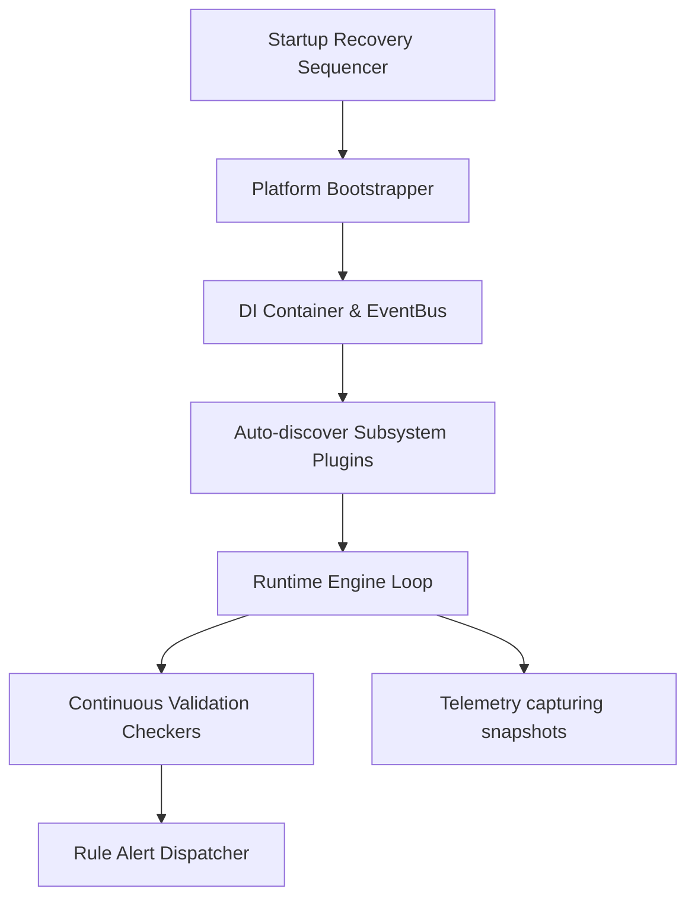

# TOJI V1 System Overview

This document provides a general high-level overview of the components, engines, and loops active within TOJI V1.

## Platform Statistics
- **Total Packages**: 59
- **Total Modules**: 760
- **Total Plugins**: 52
- **Total Interfaces**: 199
- **Total Repositories**: 105

## System Flow Model

