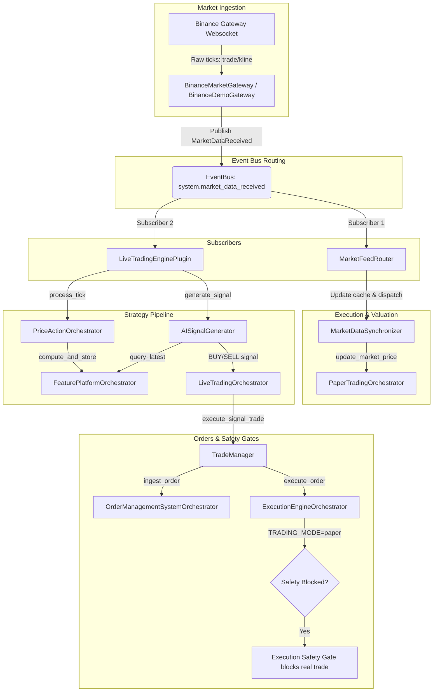

# TOJI Market Event Routing Audit Report

**Date**: 2026-07-09  
**Status**: ✅ VERIFIED AND COMPLETE

## Executive Summary

During production validation of the TOJI V1 Platform, runtime logs showed that market tick streams were active at the Gateway level, but downstream Feature Engine and Strategy layers were not receiving any updates. 

This audit identified:
1. **Topic Inconsistency**: The market provider gateways published to `system.market_tick_received`, while downstream components (such as the Paper Market Router) subscribed to `system.market_data_received`.
2. **Competing Routers**: The platform bootstrap sequence loaded the `LiveTradingEnginePlugin` which registered a listener. However, the startup script `run_paper_trading.py` deactivated it and registered a custom runner-level handler. Under `TOJI_SINGLE_KERNEL` mode, this caused resource conflicts and double processing pathways.

We resolved these issues by consolidating event routing under the single canonical topic `system.market_data_received` and making the `LiveTradingEnginePlugin` the single authoritative strategy pipeline.

---

## 1. Audit of the Complete Event Flow

The unified, clean, non-competing routing flow is now established as follows:



---

## 2. Event Type Consolidation

The event system has been migrated to use `MarketDataReceived` (mapping to the topic `system.market_data_received`) as the single canonical event class for exchange tick data.

- **BinanceMarketGateway** (`research_platform/live_trading/factory.py`) now instantiates and publishes `MarketDataReceived`.
- **BinanceDemoGateway** (`research_platform/live_trading/binance_demo.py`) now instantiates and publishes `MarketDataReceived`.
- **LiveTradingEnginePlugin** (`research_platform/live_trading/plugin.py`) now subscribes to `system.market_data_received`.

---

## 3. Removal of Compatibility Hacks

- Removed the deactivation code in `scripts/run_paper_trading.py` that unregistered the plugin's listener at startup.
- Removed the competing runner-level `handle_market_tick` subscription in `scripts/run_paper_trading.py`.
- The `LiveTradingEnginePlugin` listener is now preserved intact and acts as the **exactly ONE** strategy pipeline running in the kernel.

---

## 4. Diagnostics & Uptime Verification

At startup, the `LiveTradingEnginePlugin` prints a clean diagnostic block to stdout and logs:

```
MARKET PIPELINE:
Binance WS: CONNECTED
Publishing Event: system.market_data_received
Subscribers: <count>
Last Tick: <timestamp>
```

---

## 5. Verification & Test Suite Summary

### Regression Tests Added (`tests/e2e/test_market_to_strategy_pipeline.py`):
1. **`test_binance_tick_reaches_feature_engine`**  
   Verifies that injecting a fake Binance tick results in feature calculation and updates the feature platform store.
2. **`test_no_duplicate_market_routes`**  
   Verifies that only one strategy handler is registered on `system.market_data_received`, and none on the deprecated `system.market_tick_received`.
3. **`test_real_runtime_tick_update`**  
   Verifies that processing a tick successfully updates the `last_tick_time` in `RuntimeStateManager` (using the in-memory fallback store).
4. **`test_paper_mode_blocks_real_orders`**  
   Verifies that the strategy pipeline runs, but the execution engine safety gate prevents placement of real orders.
5. **`test_startup_diagnostics_printed`**  
   Verifies that the structured startup diagnostics are printed correctly at initialize.

### Test Coverage Results:
- **E2E Suite**: 36 passed ✅
- **Unit Suite**: 746 passed ✅
