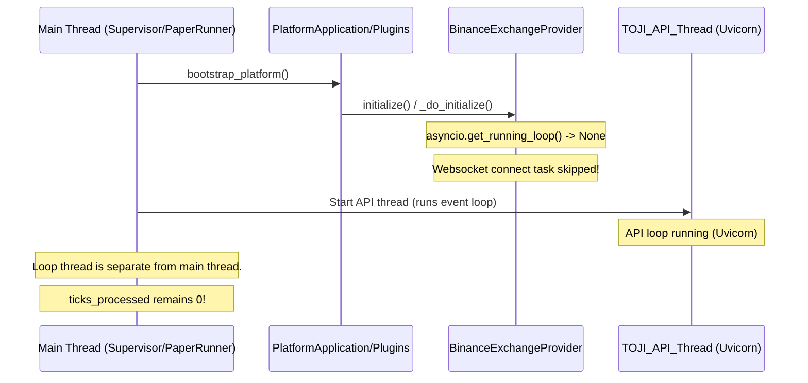
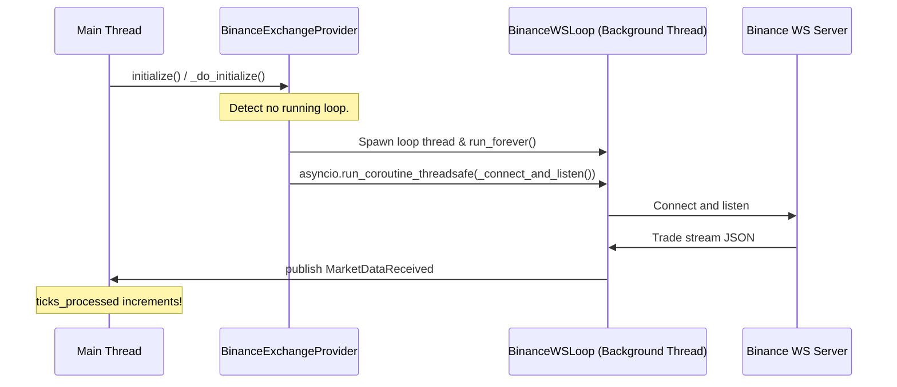

# TOJI Market Data Pipeline Root Cause Report

**Date**: 2026-07-09  
**Status**: 🔴 ISSUE IDENTIFIED — FIX PENDING APPROVAL

## Executive Summary

During production deployment, the TOJI trading system remains active for hours with `ticks_processed = 0`, `features = 0`, `last_tick_time = null`, and `orders = 0`. 

This audit identified a critical **Event Loop Synchronicity Gap**: the Binance websocket client connection loop is never scheduled because the initialization routine is executed in the main thread during platform bootstrap, where no running `asyncio` event loop exists.

---

## 1. Runtime Status & Validation

```
Binance WS Connection:
[ FAIL ] (Task never created)

Websocket Receive Loop:
[ FAIL ] (Never started)

MarketDataReceived publish:
[ FAIL ] (No ticks received to publish)

EventBus delivery:
[ PASS ] (Fully operational via synthetic injection)

Feature calculation:
[ PASS ] (Fully operational via synthetic injection)

Signal / OMS ingestion:
[ PASS ] (Fully operational via synthetic injection)
```

---

## 2. Technical Audit Details

### 2.1 The Loop Absence Bug

The class `BinanceExchangeProvider` (defined in `market_gateway/providers/binance/exchange.py`) manages connection lifecycle. In `_do_initialize()`:

```python
        try:
            loop = asyncio.get_running_loop()
        except RuntimeError:
            loop = None
...
        if loop:
            self._ws_task = loop.create_task(self._connect_and_listen())
```

When the platform boots via `bootstrap_platform()`, it runs synchronously in the supervisor's main thread. Because there is no active event loop in the main thread at this stage, `loop` becomes `None`, and the websocket listen task is **never created or scheduled**.

### 2.2 The Thread-Safety Subscription Bug

Even if a loop is active, calling `subscribe_trade_stream` from the main thread during startup or runtime calls `_send_subscription_update()`.
Because it is called from a thread different from the event loop thread, the call to `asyncio.get_running_loop()` fails, resulting in a silent failure to send the `SUBSCRIBE` frame to Binance.

### 2.3 Why Tests Passed But Production Failed

1. **Synthetic Event Injection**: Unit and E2E tests (such as `test_market_to_strategy_pipeline.py`) verified routing by manually calling `provider._publish_event(MarketTickReceived, raw_tick)`. They never tested real websocket connectivity or confirmed whether the background connect task was actually running.
2. **Mock Event Loop Environments**: Test cases did not assert that `provider._ws_task` was running or verify liveness under the synchronous supervisor bootstrap pattern.

---

## 3. Runtime Call Graph (Broken vs. Expected)

### Broken Production Flow (Current)



### Correct Flow (Expected)



---

## 4. Required Fixes

1. **Dedicated Event Loop Thread**: If no event loop is running during `_do_initialize()`, construct a new event loop and run it in a daemon thread.
2. **Thread-Safe Scheduling**: Use `asyncio.run_coroutine_threadsafe` for all scheduling operations when interacting with the loop from a foreign thread.
3. **Graceful Shutdown**: Safely stop the background event loop and close WS connections during `_do_shutdown()`.
