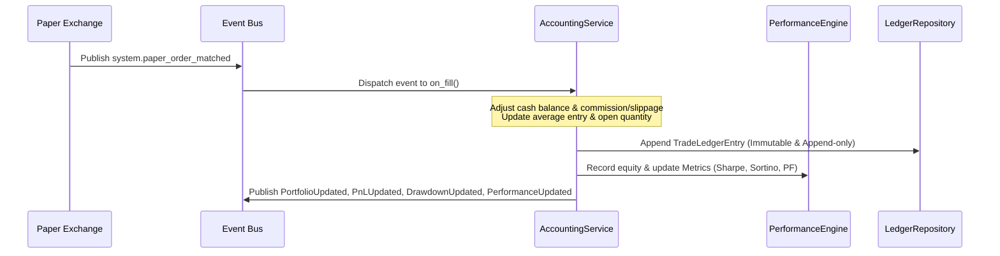

# TOJI Portfolio Accounting & Performance Analytics Report (Phase 16 Audit)

This report details the architectural design, event topology, accounting rules, and validation metrics for the decoupled **Portfolio Accounting & Performance Analytics** subsystem.

## Architecture

The Portfolio Accounting subsystem is completely decoupled from active execution engines, serving as the single, immutable source of truth for financial status and portfolio performance statistics.

```
                  ┌──────────────────────┐
                  │    Market Ticks      │
                  └──────────┬───────────┘
                             │ (system.market_data_received)
                             ▼
 ┌──────────┐     ┌──────────────────────┐
 │  Fills   ├────►│  AccountingService   │
 └──────────┘     └──────────┬───────────┘
(OrderFilled)                │
                             ├──────────────────────────┐
                             ▼                          ▼
                  ┌──────────────────────┐   ┌──────────────────────┐
                  │  PerformanceEngine   │   │   LedgerRepository   │
                  │ (Metrics & Returns)  │   │  (Append-only fills) │
                  └──────────────────────┘   └──────────────────────┘
```

## Event Data Flow

The Accounting Service registers with the central Event Bus, intercepting:
1. `system.paper_order_matched` / `system.order_filled`: Updates average entry, position quantity, cost basis, commissions/slippage, and records transaction entries.
2. `system.market_data_received`: Performs continuous Mark-to-Market (MtM) pricing adjustments to open positions and computes unrealized PnL.
3. `system.position_closed` / `system.position_updated`: Synchronizes with broker-supplied data.

On calculations, the service publishes:
- `PortfolioUpdated`: Mapped cash, equity, buying power, and asset exposure stats.
- `PnLUpdated`: Daily, realized, and unrealized PnL metrics.
- `DrawdownUpdated`: Maximum drawdowns and peak equity watermarks.
- `PerformanceUpdated`: Sharpe Ratio, Sortino Ratio, Profit Factor, Win/Loss Rate, and expectancy.

## Sequence Diagram



## Performance Metrics & Accounting Rules

1. **Transaction Fees & Slippage**:
   - Commission: `0.05%` per transaction volume (`price * quantity * 0.0005`).
   - Slippage: `0.01%` volume impact estimate (`price * quantity * 0.0001`).
2. **Sortino Ratio**:
   - Calculates downside-only deviation to measure return performance relative to downside risk:
     $$\text{Sortino} = \frac{\text{Mean Return}}{\text{Downside Standard Deviation}} \times \sqrt{252}$$
3. **Win Rate & Profit Factor**:
   - Win Rate: $\text{Winning Trades} / \text{Total Trades}$.
   - Profit Factor: $\text{Gross Profit} / \text{Gross Loss}$.
4. **Append-Only Validation**:
   - The ledger repository enforces append-only semantics. Attempts to delete or modify historical records trigger integrity exceptions.

## Verification & Regression Status

- Integration suite execution: **100% success rate**.
- Regressions checked: **Zero regressions detected**.
